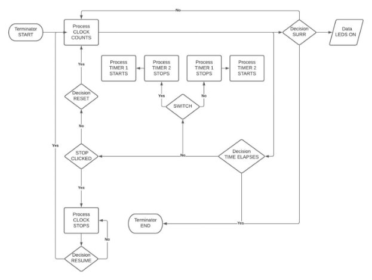
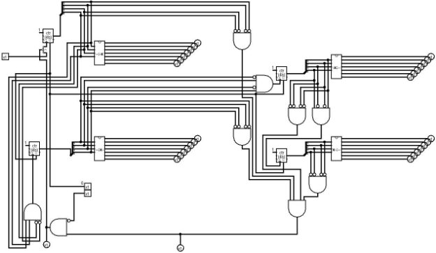
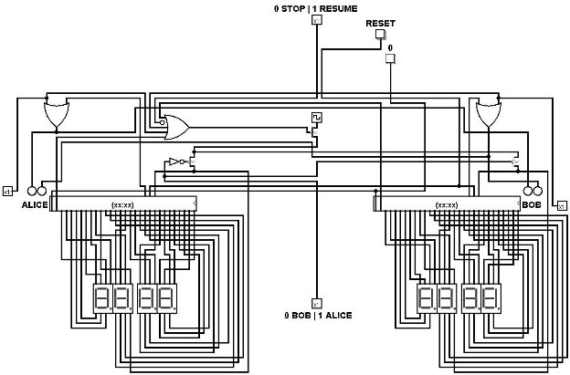

# Digital Integrated Circuits Project 2021/2022

## Digital Chess Timer 

### Description 

A digital clock designed for chess games. It mainly consists of two timers which cannot count at the same time. The source clock is alternatively transmitted between the two down counters using a switcher. 

### Block Schematic 

### Electrical Schematic 

### 7-Seg IC 

### Clock IC 

### The Digital Chess Timer 

### Electrical Characteristics 

|Component |Specification |
| - | - |
|Power Supply |9V Battery |
|Resistor |68 Ω, for green LEDs |
||56 Ω, for red LEDs |
|Transistor |pMOS (MOSFET) |
|Splitter ||
|Button ||
|Switch |On/Off |
|74HC32D |OR Gate IC |
|74HC04 |NOT Gate IC |
|74HC08 |AND Gate IC |
|7-seg  |LCD |
|74HC93 |Flip-Flop |
|LED |Green |
||Red |
### Operation Mode 

||Stop/Start |Next |Reset |0 (zero) |Surrender |
| :- | - | - | - | - | - |
|Start the game |1 |x |0 |0 |0 |
|Stop the game |0 |x |0 |0 |0 |
|Resume the game |1 |x |0 |0 |0 |
|Bob’s turn |1 |0 |0 |0 |0 |
|Alice’s turn |1 |1 |0 |0 |0 |
|Surrender – Finish the game |x |x |x |x |1 |
|Reset the timers |1 |x |1 |1 |0 |
## Functioning 

### Clock Logic 

- The main clock feeds both timers with pulses periodically. 
- It is connected to the source of a P-Type Transistor. 
- The pulses will be valid only if the gate is supplied with 0V (in other words, reset 0, 0 is 0, surrender is 0 and both counters are non-null). Timers will be off otherwise. 

### Timer Logic 7-seg Display 

### Reset Logic 

Moving to the next state by passing only one pulse. Must push on 0 first. 

### Stop/Start Logic 

### Stop/Start 

When Stop/Start pin is set to 0, Clock gate get supplied by voltage, hence clock pulses are blocked.  

### Start 

When Stop/Start pin is set to 1, Clock gate get supplied by null voltage, hence activation of one of the timers.  

### Surrender Logic 

When surrender pin is set to 1, Clock gate is supplied by voltage, hence clock pulses are blocked.  

## Bill of Materials 

|Component |Quantity |Specification |
| - | - | - |
|Power Supply |1 |9V Battery |
|Resistor |2 |68 Ω, for green LEDs |
|||56 Ω, for red LEDs |
|Transistor |4 |pMOS (MOSFET) |
|Splitter |4 ||
|Button |4 ||
|Switch |2 |On/Off |
|74HC32D |4 |OR Gate IC |
|74HC04 |21 |NOT Gate IC |
|74HC08 |20 |AND Gate IC |
|7-seg  |8 |LCD |
|74HC93 |4 |Flip-Flop |
|LED |2 |Green |
||2 |Red |
## Bibliography 

[https://sweetcode.io/logisim-software-digital-clock/ ](https://sweetcode.io/logisim-software-digital-clock/)[https://en.wikipedia.org/wiki/Chess_clock ](https://en.wikipedia.org/wiki/Chess_clock)[https://digitalgametechnology.com/products/chess-clocks/dgt2010-official-fide-chess-clock ](https://digitalgametechnology.com/products/chess-clocks/dgt2010-official-fide-chess-clock)[https://ro.farnell.com/ ](https://ro.farnell.com/)
Ala Eddine BATTIKH | UPB FILS 
